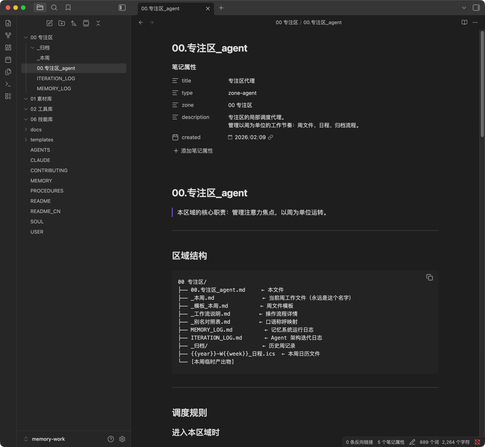

<div align="center">

# Memory Work

**一套 AI 时代的注意力保护架构**

[中文](./README_CN.md) | English

[](https://opensource.org/licenses/MIT)
[](https://claude.ai)
[](https://obsidian.md)

</div>

> 🌐 **Bilingual Support**: On first run, you'll be asked to choose between **中文** or **English**. All templates will automatically switch to your preferred language.

---

## The Problem

When you're juggling 10+ parallel projects, traditional AI assistants make things worse:

- **AI amnesia**: Every conversation starts from scratch. You repeat context endlessly.
- **You become the bottleneck**: Ideas → *you* structure → *you* input → *you* maintain
- **Knowledge base becomes burden**: The bigger it gets, the harder to manage

---

## The Solution

**Memory Work** flips the script:

- Ideas → **just dictate** → AI structures → AI maintains
- AI reads layered files at startup → **no more amnesia**
- Divide-and-conquer agents → **scales to any vault size**

**You only do two things: provide attention focus, make creative decisions.**

AI handles the rest: integrating history, matching materials, structured output.

---

## How It Works in Claude Code

### First Run: Smart Initialization

When you clone this repo and open it in Claude Code, the AI automatically:

```
1. Detects it's a fresh installation
2. Asks your preferred language (中文 / English)
3. Collects your basic info to create your profile
4. Creates your first week's workspace
5. Shows you how to open in Obsidian
6. Asks: "What do you want to work on this week?"
```

**You don't configure anything manually.** Just talk.

<div align="center">


*Step 1: Language selection and file initialization*


*Step 2: Voice-first user profile configuration*

</div>

### Daily Usage: Voice-First Workflow

```
You: "This week I need to finish the proposal, prep for Wednesday's
     client meeting, and that partnership agreement needs follow-up."

Claude:
1. Breaks into 3 tasks, writes to _this_week.md
2. Searches your vault for related materials
3. Asks you to clarify uncertainties
4. Proactively asks: "Want me to generate a calendar file?"
```

You dictate naturally. Claude structures. **Your flow state stays protected.**

### Calendar Generation

After discussing tasks, Claude proactively guides you to create calendar events:

```
Claude: "Tasks are organized. I noticed some have time arrangements:
         1. Wednesday 10:00-12:00 Client meeting
         2. Friday 14:00 deadline - Submit proposal

         Want me to generate a calendar file you can import?"

You: "Sure, the client meeting is 10:00 to 11:30"

Claude: [Generates 2026-W06_schedule.ics]
        "Calendar file generated. Double-click to import to macOS Calendar,
         or use 'Import' in Google Calendar."
```

### Weekly Rhythm

```
Monday          →        Mid-week        →         Friday
   │                        │                        │
   ▼                        ▼                        ▼
┌─────────┐           ┌─────────┐            ┌─────────┐
│ Dictate │           │ Progress│            │ Archive │
│   ↓     │           │   ↓     │            │   ↓     │
│AI struct│ ────────▶ │AI assist│ ─────────▶ │AI review│
│   ↓     │           │   ↓     │            │   ↓     │
│Schedule │           │ Output  │            │New week │
└─────────┘           └─────────┘            └─────────┘
```

| Phase | You Do | Claude Does |
|-------|--------|-------------|
| **Monday** | Dictate what you want to do | Structure tasks, pull materials, generate calendar |
| **Mid-week** | Work, add notes anytime | Track progress, search vault, assist decisions |
| **Friday** | Give feedback on memories | Calibrate memory, archive, create next week |

---

## Four-Layer Memory Architecture

The core mechanism that solves AI amnesia. Inspired by [Titans](https://arxiv.org/abs/2501.00663) (surprise-driven) and [MemSkill](https://arxiv.org/abs/2501.03313) (evolvable memory).

```
Layer 0 · Persistent    SOUL.md / USER.md       Who you are, who AI is
Layer 1 · Working       _this_week.md           Current week's focus
Layer 2 · Dynamic       MEMORY.md               Cross-week insights, with lifecycle
Layer 3 · Procedural    PROCEDURES.md           "When X happens, do Y" patterns
```

### How Memory Evolves

```
Conversation → AI detects "surprise" → Proposes to remember
                      ↓
          You confirm → Memory saved with metadata
                      ↓
          Weekly review → Calibrate usefulness → Strengthen or decay
```

**Surprise-driven**: Only writes when something deviates from known patterns. No noise.

**User-confirmed**: AI proposes, you approve. Nothing written without consent.

**Has lifecycle**: Strong memories persist (★★★), weak ones fade (★☆☆ → archive after 4 weeks inactive).

---

## Focus Zone: Your Attention Anchor

The `00 Focus Zone/` (or `00 专注区/`) is the heart of the system:

```
00 Focus Zone/
├── _this_week.md      ← Your current attention focus
│   ├── Original dictation (your raw thoughts)
│   ├── Task list (AI-structured)
│   ├── Reference materials (AI-searched)
│   ├── Progress log (by date)
│   └── To be archived
├── MEMORY_LOG.md      ← Memory system's own journal
├── ITERATION_LOG.md   ← Architecture evolution log
└── _archive/          ← Past weeks
```

<div align="center">


*Complete Focus Zone structure in Obsidian*

</div>

**One week, one file.** Archive on Friday, fresh start on Monday. You never manage the backlog—it's always archived and searchable.

---

## Quick Start

### 1. Clone the Repository

Open Terminal and run:

```bash
git clone https://github.com/yiliqi78/memory-work.git
```

Or download directly: [Download ZIP](https://github.com/yiliqi78/memory-work/archive/refs/heads/main.zip)

### 2. Open in Claude Code

```bash
cd memory-work
claude .
```

Or if using Cursor / VS Code with Claude extension:
```bash
cd memory-work
cursor .   # or: code .
```

### 3. Start Talking

**Send any message to start** (e.g., "Let's begin", "Hi"), Claude will automatically detect it's a first-time setup and guide you through initialization:

```
You: "Let's begin"

Claude: "Welcome to Memory Work! 🎉

         This is a knowledge management system that gives AI persistent memory.

         First, choose your preferred language:
         1. 中文
         2. English

         Enter 1 or 2:"

You: "2"

Claude: [Keeps English templates]
        "Great! Let me quickly get to know you:
         1. What should I call you?
         2. What's your profession?
         3. What project are you currently working on?"

You: "Call me Alex, I'm a product manager working on an AI education product"

Claude: [Creates USER.md, MEMORY.md, _this_week.md]
        "Alex, it's Monday, a new week begins.
         What do you want to work on this week? Just tell me, I'll organize it."
```

### 4. Open in Obsidian (Optional)

For graph view and wiki-links:

1. Open Obsidian
2. "Open folder as vault"
3. Select the cloned `memory-work` folder

---

## Project Structure

```
memory-work/
├── CLAUDE.md              # Smart initialization instructions
├── AGENTS.md              # AI behavioral rules (the "OS kernel")
├── SOUL.md                # AI personality definition
├── USER.md                # Your profile
├── MEMORY.md              # Long-term dynamic memory
├── PROCEDURES.md          # "Context → Action" patterns
│
├── 00 Focus Zone/         # Weekly workspace (Layer 1)
│   ├── _this_week.md      # Current week
│   ├── MEMORY_LOG.md      # Memory system log
│   └── _archive/          # Past weeks
│
├── 01 Materials/          # Your knowledge base
├── 02 Tools/              # Reusable templates
├── 06 Skills/             # Custom AI capabilities
│
└── templates/
    ├── zh-CN/             # Chinese templates
    └── en/                # English templates
```

---

## Key Concepts

### Voice-First
Don't structure your thoughts. Just talk. AI handles the organization.

> 💡 **Note**: Memory Work itself doesn't include voice recognition. We recommend pairing it with a voice input tool like [Typeless](https://www.typeless.com/), [闪电说](https://shandianshuo.cn/), or any system-level speech-to-text.

### Divide-and-Conquer Agents
Each folder has its own agent file (`00.xxx_agent.md`) with specific rules. Personal archives need item-by-item confirmation. Project files stay isolated. Skills can be freely modified.

### Skill System
Package your workflows as reusable skills. When you solve a problem repeatedly, tell Claude: "Turn this into a skill." Next time, it triggers automatically.

### Self-Evolution
The system gets smarter every week:
- **Memory evolution**: MEMORY_LOG.md tracks what worked
- **Behavior evolution**: PROCEDURES.md accumulates your patterns
- **Architecture evolution**: ITERATION_LOG.md records changes

---

## Design Philosophy

1. **You provide focus, AI provides structure** — Don't adapt to the tool, let the tool adapt to you
2. **Local-first** — Your data stays on your machine, plain Markdown files
3. **Surprise-driven** — Only remember what's genuinely new
4. **Weekly rhythm** — Time boundaries protect your attention
5. **Evolvable** — System grows with you, not against you

---

## Requirements

- [Claude Code](https://claude.ai) or Claude Desktop with Projects
- [Obsidian](https://obsidian.md) (optional, for graph view)
- **Voice input tool** (recommended): [Typeless](https://www.typeless.com/), [闪电说](https://shandianshuo.cn/), or system speech-to-text

---

## Inspiration

Built on:
- [Titans: Learning to Memorize at Test Time](https://arxiv.org/abs/2501.00663)
- [MemSkill: Transferrable and Evolvable Memory Skill Library](https://arxiv.org/abs/2501.03313)
- Real-world practice managing 10+ parallel projects

---

## Contributing

See [CONTRIBUTING.md](CONTRIBUTING.md). We welcome new skills, translations, and improvements.

---

## License

MIT — see [LICENSE](LICENSE)

---

<div align="center">

**You don't need to remember everything. You just need to focus on now.**

Created by [@yiliqi78](https://github.com/yiliqi78)

</div>
