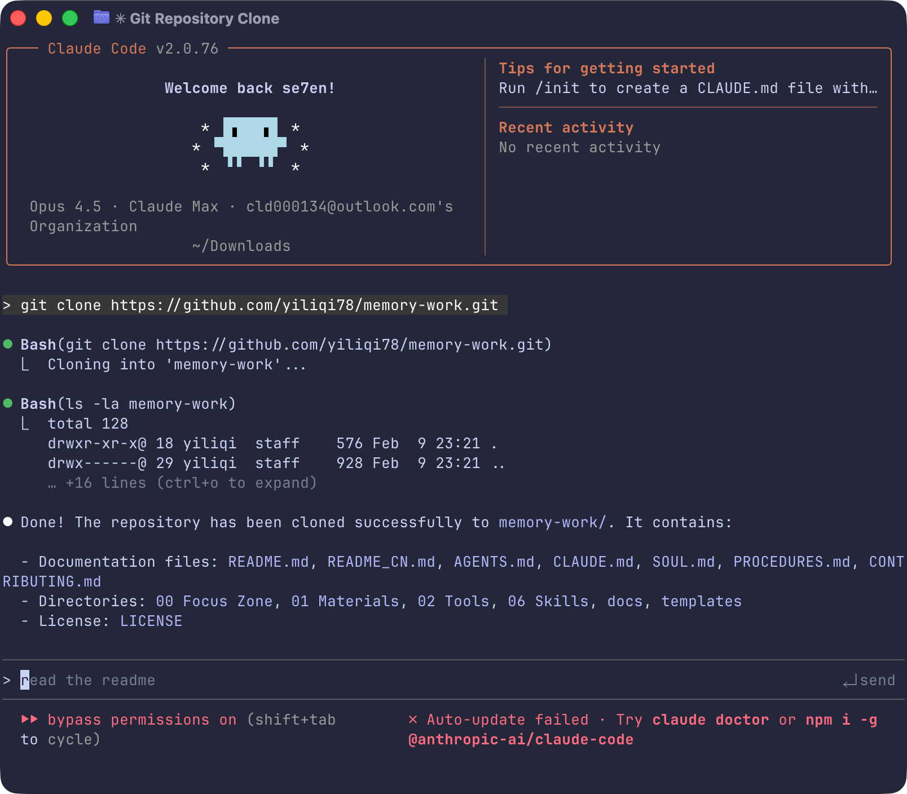

<div align="center">

# Memory Work

**一套 AI 时代的注意力保护架构**

中文 | [English](./README.md)

[](https://opensource.org/licenses/MIT)
[](https://claude.ai)
[](https://obsidian.md)

</div>

> 🌐 **双语支持**：首次运行时，你可以选择 **中文** 或 **English**，所有模板将自动切换到你的语言。

---

## 痛点

当你同时面对 10 个以上并行项目，传统 AI 助手反而让事情更糟：

- **AI 失忆**：每次对话从零开始，你要反复喂上下文
- **你成了瓶颈**：想法 → *自己*结构化 → *自己*录入 → *自己*维护
- **知识库成负担**：库越大，管理成本越高

---

## 解法

**Memory Work** 把流程反过来：

- 想法 → **直接口述** → AI 结构化 → AI 维护
- AI 启动时自动读取分层文件 → **不再失忆**
- 分治代理 → **可扩展到任意规模**

**你只负责两件事：提供注意力焦点，做创意决策。**

AI 负责其余：整合历史信息、匹配相关语料、执行结构化输出。

---

## 在 Claude Code 中如何使用

### 首次运行：智能初始化

克隆仓库后用 Claude Code 打开，AI 会自动：

```
1. 检测到这是全新安装
2. 询问你的偏好语言（中文 / English）
3. 收集你的基本信息，创建用户档案
4. 创建你的第一周工作区
5. 告诉你如何在 Obsidian 中打开
6. 问你：「这周想做什么？」
```

**你不需要手动配置任何东西。** 直接开聊。

<div align="center">


*步骤 1：语言选择与文件初始化*


*步骤 2：口述式用户画像配置*

</div>

### 日常使用：口述优先

```
你："这周要把产品文档整理一下，周三有个客户会议要准备演示方案，
    另外那个合作协议让团队跟进一下。"

Claude：
1. 拆解为 3 个任务，写入 _本周.md
2. 搜索全库相关材料，摘录到参考材料区
3. 向你确认不确定的点
4. 主动询问：「要我生成日历文件吗？」
```

你自然口述，Claude 结构化。**心流状态受保护。**

### 日历生成

讨论完任务后，Claude 会主动引导你创建日程：

```
Claude："任务整理好了。我注意到有几个带时间的安排：
        1. 周三 10:00-12:00 客户会议
        2. 周五 14:00 截止 - 提交方案

        要我生成一个日历文件吗？可以直接导入日历软件。"

你："好的，客户会议是 10:00 到 11:30"

Claude：[生成 2026-W06_日程.ics]
       "日历文件已生成。双击即可导入 macOS 日历，
        或在 Google Calendar 中选择「导入」。"
```

### 周节奏

```
周一             →         周中            →          周五
  │                         │                         │
  ▼                         ▼                         ▼
┌─────────┐           ┌─────────┐            ┌─────────┐
│  口述   │           │  推进   │            │  归档   │
│   ↓     │           │   ↓     │            │   ↓     │
│AI 转化  │ ────────▶ │AI 补充  │ ─────────▶ │AI 校准  │
│   ↓     │           │   ↓     │            │   ↓     │
│  排程   │           │  产出   │            │  新周   │
└─────────┘           └─────────┘            └─────────┘
```

| 阶段 | 你做什么 | Claude 做什么 |
|------|----------|---------------|
| **周一** | 口述本周想做的事 | 拆解任务，拉取材料，生成日历 |
| **周中** | 工作，随时补充想法 | 跟踪进展，搜索全库，辅助决策 |
| **周五** | 对记忆操作给反馈 | 校准记忆，归档，创建下周 |

---

## 四层记忆架构

解决「AI 失忆」的核心机制。灵感来自 [Titans](https://arxiv.org/abs/2501.00663)（惊奇度驱动）和 [MemSkill](https://arxiv.org/abs/2501.03313)（可进化记忆）论文。

```
Layer 0 · 持久记忆    SOUL.md / USER.md        你是谁，AI 是谁
Layer 1 · 工作记忆    _本周.md                  当前周的注意力焦点
Layer 2 · 动态记忆    MEMORY.md                 跨周洞见，有生命周期
Layer 3 · 程序性记忆  PROCEDURES.md             「遇到 X 就做 Y」的模式
```

### 记忆如何进化

```
对话 → AI 检测到「惊奇」→ 提议记住
              ↓
      你确认 → 写入记忆（带元数据）
              ↓
      周复盘 → 校准有用性 → 增强或衰减
```

**惊奇度驱动**：只有偏离已知模式的信息才会写入。没有噪音。

**用户确认**：AI 提议，你批准。未经同意不写入任何内容。

**有生命周期**：强记忆持久（★★★），弱记忆衰减（★☆☆ → 4 周未激活则归档）。

---

## 专注区：你的注意力锚点

`00 专注区/`（或 `00 Focus Zone/`）是整个系统的心脏：

```
00 专注区/
├── _本周.md           ← 当前的注意力焦点
│   ├── 口述原文（你的原始想法）
│   ├── 任务清单（AI 结构化）
│   ├── 参考材料（AI 搜索）
│   ├── 进展记录（按日期）
│   └── 待归档清单
├── MEMORY_LOG.md      ← 记忆系统自己的日志
├── ITERATION_LOG.md   ← 架构进化日志
└── _归档/             ← 历史周记录
```

<div align="center">


*在 Obsidian 中查看专注区的完整结构*

</div>

**一周一个文件。** 周五归档，周一新建。你不需要管理积压——全部归档可检索。

---

## 快速开始

### 1. 克隆仓库

打开终端，运行：

```bash
git clone https://github.com/yiliqi78/memory-work.git
```

或直接下载：[下载 ZIP](https://github.com/yiliqi78/memory-work/archive/refs/heads/main.zip)

### 2. 用 Claude Code 打开

```bash
cd memory-work
claude .
```

或者使用 Cursor / VS Code：
```bash
cd memory-work
cursor .   # 或: code .
```

### 3. 开始对话

**发送任意消息启动**（例如：「开始工作」「Hi」），Claude 会自动检测到是首次使用，并引导你完成初始化：

```
你："开始工作"

Claude："你好！欢迎使用 Memory Work 🎉

        这是一个让 AI 拥有持久记忆的知识管理系统。

        首先，请选择你的偏好语言：
        1. 中文
        2. English

        输入 1 或 2："

你："1"

Claude：[切换到中文模板]
       "好的！让我快速了解你：
        1. 你希望我怎么称呼你？
        2. 你的职业是什么？
        3. 目前在做什么项目？"

你："叫我小明，我是产品经理，在做一个 AI 教育产品"

Claude：[创建 USER.md, MEMORY.md, _本周.md]
       "小明，今天周一，新的一周开始。
        说说这周想推进什么？随便说，我来整理。"
```

### 4. 在 Obsidian 中打开（可选）

想要图谱视图和双链：

1. 打开 Obsidian
2. 「打开文件夹作为仓库」
3. 选择克隆的 `memory-work` 文件夹

---

## 项目结构

```
memory-work/
├── CLAUDE.md              # 智能初始化指令
├── AGENTS.md              # AI 行为规范（「操作系统内核」）
├── SOUL.md                # AI 人格定义
├── USER.md                # 你的画像
├── MEMORY.md              # 长期动态记忆
├── PROCEDURES.md          # 「情境→行动」模式
│
├── 00 专注区/              # 周工作台（Layer 1）
│   ├── _本周.md            # 当前周
│   ├── MEMORY_LOG.md       # 记忆系统日志
│   └── _归档/              # 历史周记录
│
├── 01 素材库/              # 你的知识库
├── 02 工具库/              # 可复用模板
├── 06 技能库/              # 自定义技能
│
└── templates/
    ├── zh-CN/             # 中文模板
    └── en/                # 英文模板
```

---

## 核心概念

### 口述优先
不用整理思路。随便说。AI 来组织。

> 💡 **说明**：Memory Work 本身不包含语音识别功能，需要配合语音输入工具使用。推荐：[闪电说](https://shandianshuo.cn/)、[Typeless](https://www.typeless.com/)，或系统自带的语音输入。

### 分治代理
每个文件夹有自己的代理文件（`00.xxx_agent.md`），定义独立规则。个人档案需逐条确认。项目文件保持隔离。技能可自由修改。

### 技能系统
把你的工作流封装成可复用的技能。当你重复解决某类问题，告诉 Claude：「把这个做成一个 skill。」下次自动触发。

### 自我进化
系统每周都在变聪明：
- **记忆进化**：MEMORY_LOG.md 跟踪什么有效
- **行为进化**：PROCEDURES.md 积累你的模式
- **架构进化**：ITERATION_LOG.md 记录变更

---

## 设计哲学

1. **你提供焦点，AI 提供结构** — 不是你适应工具，是工具适应你
2. **本地优先** — 数据留在你的机器，纯 Markdown 文件
3. **惊奇度驱动** — 只记真正新的东西
4. **周节奏** — 时间边界保护你的注意力
5. **可进化** — 系统和你一起成长，而不是对抗你

---

## 需求

- [Claude Code](https://claude.ai) 或 Claude Desktop with Projects
- [Obsidian](https://obsidian.md)（可选，用于图谱视图）
- **语音输入工具**（推荐）：[闪电说](https://shandianshuo.cn/)、[Typeless](https://www.typeless.com/)，或系统自带语音输入

---

## 灵感来源

基于：
- [Titans: Learning to Memorize at Test Time](https://arxiv.org/abs/2501.00663)
- [MemSkill: Transferrable and Evolvable Memory Skill Library](https://arxiv.org/abs/2501.03313)
- 管理 10+ 并行项目的真实实践

---

## 贡献

参见 [CONTRIBUTING.md](CONTRIBUTING.md)。欢迎新技能、翻译和改进。

---

## 许可证

MIT — 见 [LICENSE](LICENSE)

---

<div align="center">

**你不需要记住一切，你只需要专注于当下。**

由 [@yiliqi78](https://github.com/yiliqi78) 创建

</div>
